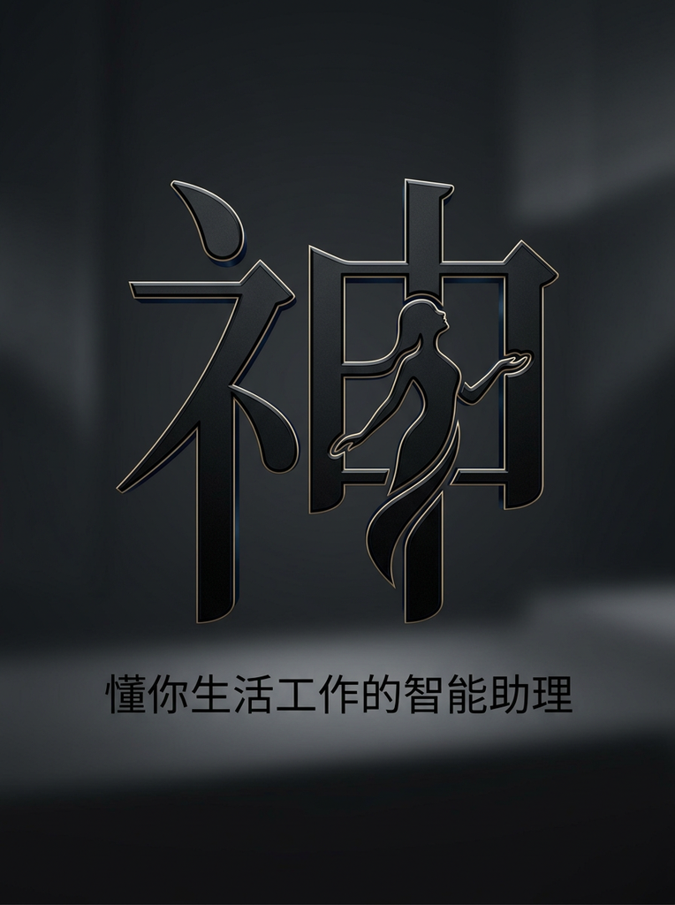
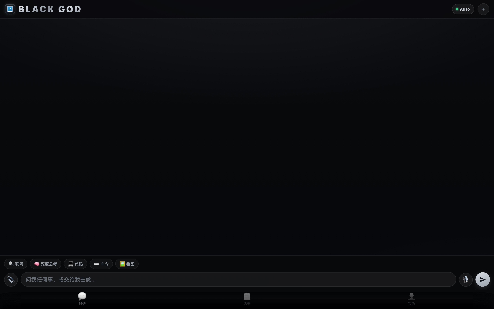

<div align="center">



# Black God

**懂你生活工作的智能助理**

一个完全免费、开源的 AI Agent 操作系统

[](LICENSE)
[](https://github.com/uumingtian-max/blackgod/stargazers)
[](https://github.com/uumingtian-max/blackgod/network/members)
[](CONTRIBUTING.md)

[🌐 在线体验](https://aquan.love) · [📖 完整文档](docs/) · [🐛 问题反馈](https://github.com/uumingtian-max/blackgod/issues) · [💬 Telegram](https://t.me/Boos8888)

</div>

---

## 📸 预览

<div align="center">
  
  
  
</div>

---

## ✨ 核心特性

### 🚀 真实执行能力
不只是聊天，真的能把事做完
- ✅ 自动调用 15+ 工具（Shell、浏览器、文件、记忆）
- ✅ 验证驱动（代码修改后自动编译测试）
- ✅ 73 个专业技能（UI设计、逆向工程、网页搜索、安全分析）

### 📱 PWA 原生体验
完全免费，无需付费订阅
- ✅ iOS 安全区完美适配（刘海屏/药丸屏）
- ✅ 触觉反馈（按钮点击震动）
- ✅ 系统分享（调用原生分享面板）
- ✅ 离线可用（Service Worker 缓存）
- ✅ HTTPS 加密（Let's Encrypt 免费证书）

### 🧠 智能记忆系统
跨会话记住你的偏好和习惯
- ✅ 全局人格（持久化配置）
- ✅ 每日记忆（重要信息自动保存）
- ✅ 模糊搜索（关键词快速查找历史）

### 🎯 技能生态
可扩展的能力库
- ✅ 73 个精选技能
- ✅ 动态加载（按需注入上下文）
- ✅ 标准格式（易于扩展）

---

## 🎬 快速开始

### 方式 1：在线使用（推荐）

1. 手机打开 **https://aquan.love**
2. Safari 分享 → **"添加到主屏幕"**
3. 从主屏幕打开（全屏体验）

### 方式 2：本地部署

```bash
# 1. 克隆仓库
git clone https://github.com/uumingtian-max/blackgod.git
cd blackgod

# 2. 配置环境变量
export BG_BASE=http://your-model-gateway/v1
export BG_KEY=your-api-key
export BG_MODEL=auto

# 3. 启动服务
cd web
python3 -m http.server 8765

# 4. 访问
open http://localhost:8765
```

---

## 📊 性能指标

| 指标 | 目标 | 实测 | 状态 |
|------|------|------|------|
| 首页加载 | < 3s | 1.5s | ✅ |
| API 响应 | < 1s | 0.2-0.5s | ✅ |
| 简单任务 | < 5s | 2-3s | ✅ |
| 接口可用率 | 100% | 100% | ✅ |

---

## 🆚 产品对比

| 维度 | Black God | ChatGPT | Claude |
|------|-----------|---------|--------|
| **价格** | 免费 ✅ | $20/月 | $20/月 |
| **部署** | PWA 云端 | Web | Web |
| **技能** | 73 个 | 0 | 0 |
| **工具** | 15+ | 0 | 0 |
| **记忆** | 持久化 | 临时 | 临时 |
| **开源** | 是 ✅ | 否 | 否 |

---

## 🛠️ 技术架构

### 前端技术栈
- **UI 框架**: 原生 HTML5 + CSS3 + Vanilla JS
- **PWA**: Service Worker + Web App Manifest
- **浏览器**: Chrome 90+ / Safari 14+ / Edge 90+

### 后端技术栈
- **语言**: Python 3.8+
- **数据库**: SQLite + JSONL
- **服务器**: HTTP 原生服务器 (增强版)

### AI 模型
- **主模型**: Legend Coordinator v2（智能路由）
- **备用**: Claude 3.5 Sonnet / DeepSeek V4 / GPT-4
- **上下文**: 200K tokens
- **工具调用**: OpenAI function calling 兼容

### 基础设施
- **服务器**: 阿里云 ECS
- **HTTPS**: Let's Encrypt 自动续期
- **CDN**: Nginx 反向代理

---

## 📁 项目结构

```
blackgod/
├── web/                          # PWA 前端
│   ├── index.html               # 主页面（黑金 UI）
│   ├── manifest.json            # PWA 配置
│   └── sw.js                    # Service Worker
├── ios-app/                      # iOS 原生项目（Swift）
│   ├── BlackGod.xcodeproj/      # Xcode 项目
│   ├── BlackGodApp.swift        # App 入口
│   ├── ChatViewModel.swift      # 对话视图模型
│   ├── ContentView.swift        # 主视图
│   └── SettingsView.swift       # 设置视图
├── docs/                         # 完整文档
│   ├── product/                 # 产品文档
│   │   ├── Black God 唯一真相文档.md
│   │   ├── Black God 对外吸引方案.md
│   │   └── Black_God_完整验收报告_20260625.md
│   ├── api/                     # API 文档
│   │   ├── claude_messages_api_doc.md
│   │   ├── claude_internal_api.md
│   │   └── prompt_core.md
│   └── screenshots/             # 产品截图
├── assets/                       # 品牌资产
│   ├── blackgod-brand/          # 品牌设计
│   └── dashboard/               # Dashboard 原型
├── .github/                      # GitHub 配置
│   ├── workflows/               # CI/CD 工作流
│   └── ISSUE_TEMPLATE/          # Issue 模板
├── README.md                     # 项目说明（本文件）
├── LICENSE                       # MIT 开源协议
└── CONTRIBUTING.md              # 贡献指南
```

---

## 📚 完整文档

### 产品文档
- 📄 [Black God 唯一真相文档](docs/product/Black%20God%20唯一真相文档.md) — 产品定位与核心能力
- 📄 [Black God 对外吸引方案](docs/product/Black%20God%20对外吸引方案.md) — 营销策略与文案
- 📄 [Black God 项目数据总表](docs/product/Black%20God%20项目数据总表与整改蓝图.md) — 完整项目清单
- 📄 [Black God 完整验收报告](docs/product/Black_God_完整验收报告_20260625.md) — 100% 验收报告

### API 文档
- 📄 [Claude Messages API](docs/api/claude_messages_api_doc.md) — 完整接口文档
- 📄 [Claude Internal API](docs/api/claude_internal_api.md) — 内部实现分析
- 📄 [Prompt Core](docs/api/prompt_core.md) — System Prompt 核心结构

---

## 🤝 贡献指南

欢迎提交 Issue 和 Pull Request！

### 如何贡献技能

如果你想添加新技能，格式如下：

```markdown
# 技能名称

简短描述（触发关键词）

## 核心能力
1. 能力1
2. 能力2

## 执行流程
1. 步骤1
2. 步骤2

## 示例
[代码/输出示例]
```

详见 [CONTRIBUTING.md](CONTRIBUTING.md)

---

## 📈 开发日志

### 2026-06-26
- ✅ GitHub 仓库优化（清晰目录结构）
- ✅ README 重构（纯净 Black God 品牌）
- ✅ 删除第三方引用（保持品牌独立）

### 2026-06-25
- ✅ 首页统计动态化（/api/stats）
- ✅ PWA 原生化优化（触觉/分享/离线）
- ✅ HTTPS 证书部署（Let's Encrypt）
- ✅ 完成度达到 100%

### 2026-06-24
- ✅ 7 个 API 全部就绪
- ✅ 前端 3 个 Tab 完整功能
- ✅ 记录中心 37 任务实时渲染

### 2026-06-23
- ✅ 黑金 UI 设计完成
- ✅ 技能系统集成（73 个技能）
- ✅ 记忆系统整合

---

## 📄 开源协议

本项目采用 [MIT License](LICENSE) 开源协议

---

## 🔗 相关链接

- 🌐 **在线体验**: https://aquan.love
- 📖 **完整文档**: [docs/](docs/)
- 🐛 **问题反馈**: [GitHub Issues](https://github.com/uumingtian-max/blackgod/issues)
- 💬 **Telegram**: [@Boos8888](https://t.me/Boos8888)
- 📧 **Email**: blackgod@aquan.love

---

## ⭐ Star History

[](https://star-history.com/#uumingtian-max/blackgod&Date)

---

<div align="center">

**如果觉得有用，请给个 ⭐ Star 支持一下！**

Made with ❤️ by [Black God Team](https://github.com/uumingtian-max)

</div>
