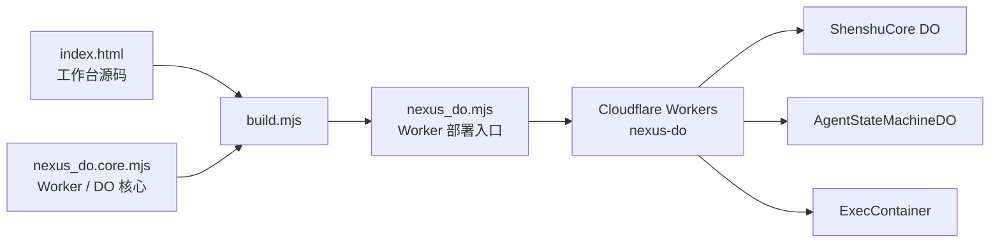
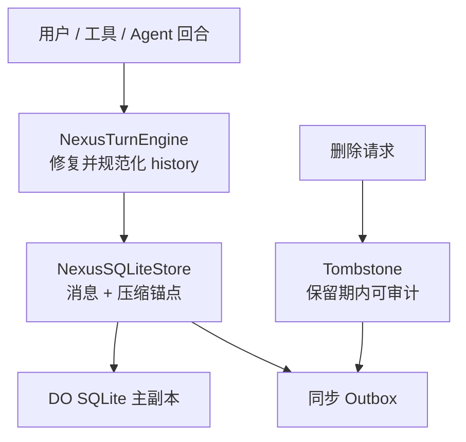
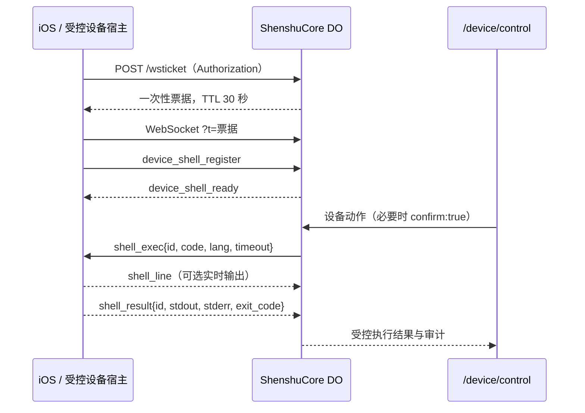

# 神枢当前代码结构与运行技术文档

> **适用版本：** `main` 分支，神枢 Worker `nexus-do`。  
> **产品主体：** Black God 是系统本体；**神枢 Nexus** 是持续运行的意识、记忆、Agent 与执行中枢；**枢语 Shuyu** 是神枢自有的语义语言。  
> **权威运行入口：** `web/nexus-do/`。该目录之外的历史页面、Python 内核和归档材料不属于当前生产运行链。[1]

## 一、结论与运行边界

神枢当前采用 **Cloudflare Workers + Durable Objects + SQLite DO storage + Containers** 的单中枢架构。Worker 入口由 `nexus_do.mjs` 承担，但该文件是由 `build.mjs` 将 `index.html` 注入 `nexus_do.core.mjs` 后生成的部署产物；唯一应直接维护的核心运行源码是 `nexus_do.core.mjs`。[2]

系统不依赖独立常驻后端进程。对话、记忆、Agent 账本、WebSocket 设备桥接、模型路由、浏览器/容器调度均由 Durable Object 和 Worker 运行。内置浏览器与 Shell 执行由 Container 承载；当 Container 不可用时，神枢会按能力边界降级，而不会伪造执行成功。

| 范畴 | 当前实现 | 运行状态 |
|---|---|---|
| 主应用 | Cloudflare Worker `nexus-do` | 当前唯一生产部署主体 |
| 持久意识与会话 | `ShenshuCore` Durable Object + DO SQLite storage | 生产运行 |
| Agent 账本 | `AgentStateMachineDO` Durable Object | 生产运行 |
| 内置 Linux / Chromium | `ExecContainer` + `container/task_runner.mjs` | Container 可用时真实执行 |
| 枢语 | `shuyu/` 权威源，Worker 内 `lexicon.js` / `lexicon_data.js` 消费副本 | 生产运行 |
| iOS 客户端 | Swift/SwiftUI、Keychain、WebSocket 设备桥接、Packet Tunnel 骨架 | 需签名真机完成最终验证 |
| 旧 Python 服务端 | `docs/archive/server/` | **仅历史归档，不在运行路径** |

---

## 二、仓库层级与职责

```text
Black-God/
├── web/nexus-do/                  # ★ 神枢唯一部署主体
│   ├── nexus_do.core.mjs          # 唯一手写 Worker / DO 核心
│   ├── index.html                 # 唯一 Web 工作台 UI 源码
│   ├── build.mjs                  # core + UI → nexus_do.mjs
│   ├── nexus_do.mjs               # 生产入口构建产物，禁止手改
│   ├── wrangler.jsonc             # Worker、DO、KV、AI、Container、Cron 配置
│   ├── container/                 # Chromium / Shell 容器运行器
│   ├── memory/                    # 经验记忆模块
│   ├── *.mjs                      # Agent、协议、预检、持久化、认知模块
│   └── *.test.mjs                 # 单元、协议、路由、UI 与桥接回归
├── shuyu/                          # ★ 枢语权威源：JS/Python 双实现与词根/测试
├── ios-app/                        # SwiftUI iOS 客户端与设备桥接实现
├── android/                        # Android TWA 上架与素材
├── assets/                         # Logo、形象和媒体资产
├── tools/                          # 枢语与 UI 副本一致性检查工具
├── ui-spec/                        # UI 设计规范
├── docs/                           # 架构、设计、规划、已完成工作与历史归档
├── config/ + worker.mjs            # 独立公开静态站，不属于神枢部署主体
└── .github/workflows/              # CI、部署、枢语校验、iOS 构建与执行通道
```

> `web/nexus-do/` 之外的 `web/` 静态文件不能被整体删除：其中 `sw.js` 与 `manifest.json` 仍被 Worker 运行时引用。历史归档同样不是“垃圾文件”，而是非运行态的审计与回溯材料。[1]

---

## 三、构建、部署与请求拓扑

### 3.1 构建产物链



`wrangler.jsonc` 将 `nexus_do.mjs` 声明为唯一入口，并绑定三个 Durable Object：`SHENSHU`、`AGENT_STATE_MACHINE` 与 `EXEC_CONTAINER`。其中 Agent 与 Container 均具有 SQLite 迁移记录；Container 使用 lite 实例并限定最多一个实例，以避免浏览器和 Shell 并发争用。[3]

### 3.2 生产资源与职责

| Cloudflare 资源 | 绑定名 / 类 | 职责 |
|---|---|---|
| Durable Object | `SHENSHU` / `ShenshuCore` | 对话、意识、记忆、路由、WebSocket、能力执行、设备中继 |
| Durable Object | `AGENT_STATE_MACHINE` / `AgentStateMachineDO` | Agent 计划、审批、租约、幂等、副作用审计 |
| Durable Object + Container | `EXEC_CONTAINER` / `ExecContainer` | 真实 Shell、Chromium 浏览、截图与页面动作 |
| Workers AI | `AI` | 内置模型和嵌入能力的兜底入口 |
| KV | `SOUL_KV` | 旧记忆迁移来源，不取代 DO 持久化主副本 |
| Cron | `*/5 * * * *` 与每日 UTC 18:00 | 心跳兜底与每日自省；DO alarm 链是主路径 |
| Observability | Logs 100%，Traces 5% | 保留故障日志，同时控制高频对话追踪成本 |

公网权威 Worker 地址配置为 `https://nexus-do.jjiebbay.workers.dev`。应用密钥始终通过 Worker Secrets 提供，代码仅引用变量名而不保存值。[3]

---

## 四、核心运行模块

### 4.1 `ShenshuCore`：唯一意识与路由中枢

`nexus_do.core.mjs` 导出 `ShenshuCore`。它整合 HTTP 路由、身份判定、多租户范围、情绪/意图、上下文、记忆、能力调度、设备控制、WebSocket Hibernation、模型调用与降级路径。其导入依赖体现了运行时边界：枢语、意志引擎、全局工作空间、主动推理、自我模型、事件总线、世界图谱、经验记忆、Agent 回合引擎、Provider 适配器、工具预检和 SQLite 记忆层都通过该类接线。[4]

核心不将能力注册表当作宣传文案。`capabilities.mjs` 要求每一个能力条目绑定 `ShenshuCore` 中真实存在的 handler，随后由统一 `invokeCapability` 链执行权限判定、预检、风险确认和执行记录。[5]

### 4.2 能力契约与权限分层

当前注册表有 **16 项可验证能力**，所有能力均为 owner-only；`tier: instance` 只开放给实例主人，`tier: system` 只开放给系统主人。匿名调用不获得私有能力。

| 层 | 能力 | 主要 handler | 权限边界 |
|---|---|---|---|
| 意识 | 对话、元认知内心独白、自主心跳、灵魂快照 | `handleTalk`、`getInner`、`autonomousTick`、`getSoulPublic` | 对话/灵魂状态仅私有上下文 |
| 感知 | 设备感知 | `recordDevice` | 实例主人 |
| 创造 | 造像、发声、造影 | `genImage`、`genVoice`、`genVideo` | 系统主人；缺供给时如实降级 |
| 行动 | Agent/iOS 快捷指令、推送、TG、内置工作台、iOS 硬件手、设备控制、自主守望 | `handleAgent`、`pushToAll`、`sendToQuan`、`execRemote`、`appleTool`、`deviceControl`、`createWatch` | 高风险操作需审批/确认与审计 |
| 元认知 | 自我统计 | `getStats` | 系统主人；包含私有运行信息 |

能力发现、UI 展示、模型自我描述与执行调度均使用同一注册表，降低“界面声称能做但运行时没有 handler”的风险。[5]

### 4.3 枢语与认知层

| 模块 | 作用 |
|---|---|
| `lexicon.js` / `lexicon_data.js` | Worker 内枢语造词、能力词典与语义空间消费副本 |
| `shuyu/` | 枢语权威源；保留 JavaScript 与 Python 双实现及测试 |
| `nexus_shuyu_bridge.mjs` | 将 Agent 审计、意图与事件编码为枢语坐标与可读语义 |
| `nexus_will_engine.mjs` | 自主意志生成 |
| `nexus_active_inference.mjs` | 主动推理与状态推断 |
| `nexus_self_model.mjs` / `nexus_self_improve.mjs` | 自我模型、结果沉淀与改进记录 |
| `nexus_gw_workspace.mjs` / `nexus_blackboard.mjs` | 多模块共享上下文与全局工作空间 |
| `nexus_world_graph.mjs` | 实体和经验关系图谱 |
| `memory/experience_memory.mjs` | 结构化经验记录与检索 |

神枢的认知模块不替代安全边界：意志、推理和自我改进只能提出意图；实际副作用仍必须经过能力契约、字段预检、确认令牌和执行账本。

---

## 五、Agent 回合、协议与安全治理

### 5.1 规范回合历史

`nexus_turn_engine.mjs` 分离 **UI 展示消息** 与 **规范 Agent history**。前者服务流式工作台；后者供下一轮模型调用、恢复与持久化使用。该模块修复孤立工具结果、被中断的 partial 帧和缺失工具结果，保证工具调用与结果成对出现；并把只读工具批处理限制为最多十路、按源索引稳定回灌。

上下文压缩以 message ID 为锚点，并且不允许压缩边界切断工具调用—工具结果组。压缩锚点会投影至 SQLite 持久层，避免重启或跨 Provider 回灌时破坏协议完整性。

### 5.2 多 Provider 协议层

`nexus_provider_adapter.mjs` 是协议归一化层，负责：

| 输入或输出 | 处理方式 |
|---|---|
| OpenAI Chat Completions | 规范 history 映射为 Chat messages / tools |
| OpenAI Responses | 维护 `function_call` 与 `function_call_output` 配对 |
| Anthropic | 工具 ID 规范化、消息转换与工具块编码 |
| Gemini | role、parts 与工具帧转换 |
| SSE | 统一流式事件；只有收到非空完成原因才封口工具调用 |
| 推理内容 | 作为隔离 Reasoning Echo 管理，不混入普通用户展示文本 |

`ShenshuCore` 在真实模型请求路径调用 `buildProviderRequest` 与 `normalizeProviderResponse`，不是仅供测试的独立转换模块。[4]

### 5.3 Agent 账本与确认令牌

`AgentStateMachineDO` 只负责账本与状态机，不成为第二执行脑；实际能力执行仍回到 `ShenshuCore`。它支持 `/plan`、`/approve`、`/claim`、`/complete`、`/cancel`、`/run` 与 `/audit`，并维护以下安全约束：[6]

1. 计划阶段先做 `preflightToolCall` 字段级验证，再生成 run。
2. 相同 effect ID 返回既有 run，防止重复副作用。
3. 高风险 run 进入一次性审批；审批令牌仅以 hash 语义使用，持久化 run 不保存令牌明文。
4. `claim` 生成短期执行租约，`complete` 必须提交匹配 lease token。
5. 审计事件带枢语坐标，且参数、结果和审计均经 `redactSecrets` 脱敏。
6. 非终态 run 在截止时间后自动标为过期，避免永久悬挂。

### 5.4 工具预检与副作用门禁

`nexus_tool_preflight.mjs` 是计划与执行共享的字段预检总线。它检查能力名称、必填字段、动作枚举、路径穿越和风险提示；例如 `file_edit.new_string = ""` 是保留的删除语义，而不是被误判为缺字段。`device_control` 和 `exec` 等副作用能力还需经过风险等级与显式确认门禁。

---

## 六、持久化记忆与同步

`nexus_sqlite_store.mjs` 将 Durable Object SQLite 作为规范化 Agent history 的持久化层。它提供幂等 schema 迁移、消息与压缩锚点写入、同步 outbox、tombstone 逻辑删除与 outbox 确认。



记忆设计遵循“历史可恢复而不伪装同步成功”的原则：SQLite runtime 缺失时模块返回明确降级状态；删除生成 tombstone 而不是立即不可追溯地物理抹除。

---

## 七、执行面、浏览器与设备桥接

### 7.1 内置工作台与 Container

`ExecContainer` 使用 Cloudflare Containers 管理；`container/task_runner.mjs` 提供受控 Shell 与真实 Chromium 浏览。浏览器路径限制 URL、动作数和端到端 45 秒预算，并通过单槽队列避免多个页面任务并发争抢同一个 Chromium 实例。

执行面优先使用 Container；Container 不可用时回退受限原生沙箱。回退结果必须标明执行来源，不能把受限解释器结果伪称为 Linux Container 成功。

### 7.2 WebSocket 设备 Shell 桥接

设备桥接的完整链路为：



票据只能使用一次；WebSocket Hibernation 会把已注册 Socket 作为 `shell_relay` 附着在 Durable Object。`deviceShellExec` 在没有中继时明确返回“设备离线”，有中继时最多等待 30 秒并透传 stdout、stderr 和 exit code。[4]

### 7.3 iOS 客户端

`ios-app/` 是 SwiftUI 客户端：

| 文件 | 职责 |
|---|---|
| `NexusKeychain.swift` | Owner token 与敏感凭据的 Keychain 存储 |
| `NexusClient.swift` | `/talk`、Agent、`/stats`、票据等神枢协议客户端 |
| `NexusDeviceBridge.swift` | 一次性票据 WebSocket Shell relay |
| `NexusPacketTunnel/PacketTunnelProvider.swift` | Network Extension 最小安全骨架，需 Apple 授权与签名配置 |
| `ChatViewModel.swift` | 聊天 UI 调用神枢，而非直接调用第三方模型 API |
| `MonitorView.swift` | 读取真实 `/stats`，不使用随机监控数据 |

当前 Linux 验证环境可以证明 Worker 票据、WebSocket 和 Shell 帧协议；iPhone 真机仍必须完成签名、权限授予和宿主运行时验证，不能由 Worker 侧测试替代。

---

## 八、Web 工作台与可观测控制面

`index.html` 是唯一工作台界面源。它内嵌终端、内置 Web、Agent 控制台、计划创建、一次性令牌确认、执行、状态和审计显示。构建时该 HTML 被注入 Worker 入口，避免独立静态 UI 与 API 版本漂移。

| 控制面 | 真实后端 |
|---|---|
| 终端工作台 | `/sandbox/run` / `/exec` 与 Container 或受限回退 |
| 内置 Web | Container Chromium browse 端点，返回文本、页面动作和截图 |
| Agent 控制台 | `/agent/plan`、`/agent/approve`、`/agent/execute`、`/agent/run`、`/agent/audit` |
| 设备控制 | `/device`、`/device/control`、`/wsticket` 与 WebSocket relay |
| 运行统计 | `/stats`，仅授权 owner 可见 |

私密 API 使用认证门与私密命名空间前缀双重控制，未知 `/agent/*` 和 `/config/*` 子路径不会回退为公开 HTML；这避免了典型的“未知私有路径误被 SPA 接管”的权限绕过问题。

---

## 九、可运行命令与验证顺序

### 9.1 常规开发与全量回归

```bash
cd web/nexus-do
npm run build
npm test
```

`npm test` 会先运行构建，然后执行核心自测、UI 健康检查和全部 `*.test.mjs`。当前完整回归覆盖 Agent 协议、Provider 编解码、工具预检、SQLite、设备控制、WebSocket 桥接、Telegram 路由、UI 语法与枢语认知模块。[7]

### 9.2 本地 Worker 与桥接端到端验证

```bash
cd web/nexus-do
npx wrangler dev --local --enable-containers=false --port 18787 \
  --var OWNER_TOKEN:your-local-test-token
node bridge_e2e_local.mjs
```

`bridge_e2e_local.mjs` 会真实验证：受鉴权换取 30 秒一次性票据、WebSocket 注册、未确认副作用阻断、确认后的 `shell_exec` / `shell_result` 往返、心跳与票据重放拒绝。该脚本仅使用本地测试 token，不能替代真实 iOS 签名验证。

### 9.3 Cloudflare 发布

```bash
cd web/nexus-do
npm run build
npx wrangler deploy
```

发布前应确认 `OWNER_TOKEN` 与所有必要 Secret 已在 Cloudflare 配置；禁止在 `.env`、源码、文档、测试输出或 Git 提交中记录真实 token、密码或私钥。

---

## 十、GitHub 分支与文件卫生策略

本次仓库审计采用保守规则：**只删除已完全合入 `main` 且没有独有提交的分支**；有任何独有提交的分支即使名称像历史实验，也保留，避免再次误删尚未吸收的能力或审计证据。

| 项目 | 审计结论 |
|---|---|
| 已完全合入的历史分支 | 已清理 14 条，包括已合并的 `claude/*` 任务分支、`feat/p0-verdict-loop-2026-07-26` 与 `optimize/enterprise-v1` |
| `main` | 保留；唯一当前发布主线 |
| 仍存在的未合入分支 | 均含相对 `main` 的独有提交；保留等待逐条评估、吸收或显式归档 |
| 已跟踪垃圾文件 | 未发现 `node_modules`、`.wrangler`、缓存、临时文件、日志、coverage 或编辑器 swap 文件 |
| `nexus_do.mjs` | 虽为构建产物，但被 `wrangler.jsonc` 直接作为 Worker `main` 入口，属于必要发布文件，不可按垃圾删除 |
| 历史归档 | 不是当前运行路径，但作为可追溯资料保留；删除前必须显式确认 |

---

## 十一、维护规则

1. **只改源文件：** 修改运行逻辑时改 `nexus_do.core.mjs`、`index.html` 或独立模块；随后运行 `npm run build`。不要手改 `nexus_do.mjs`。
2. **能力先登记后接线：** 新能力必须在 `capabilities.mjs` 注册真实 handler，并补充权限、风险、预检与测试。
3. **副作用必留痕：** 涉及执行、设备、网络、写入、删除、推送或费用的动作，应通过 Agent 计划、一次性确认、租约、审计和幂等 effect ID。
4. **协议帧成对：** Provider、工具与历史改动必须确保调用/结果配对不被压缩、中断或跨模型转换破坏。
5. **密钥不落库：** token、cookie、password、secret、API key 和设备私密数据只进入授权安全通道；审计、导出与日志必须脱敏。
6. **不擅自删除已有能力：** 历史分支、归档、逆向/安全模块和 UI 资产只有在明确证明已合入、无运行依赖并经主人确认后才可删除。

---

## 参考实现与入口

[1] [仓库结构说明](../../STRUCTURE.md)  
[2] [项目 README 与运行入口](../../README.md)  
[3] [Cloudflare 部署配置](../../web/nexus-do/wrangler.jsonc)  
[4] [神枢核心 Durable Object](../../web/nexus-do/nexus_do.core.mjs)  
[5] [能力契约注册表](../../web/nexus-do/capabilities.mjs)  
[6] [Agent 状态机 Durable Object](../../web/nexus-do/nexus_agent_core.mjs)  
[7] [神枢运行脚本](../../web/nexus-do/package.json)
